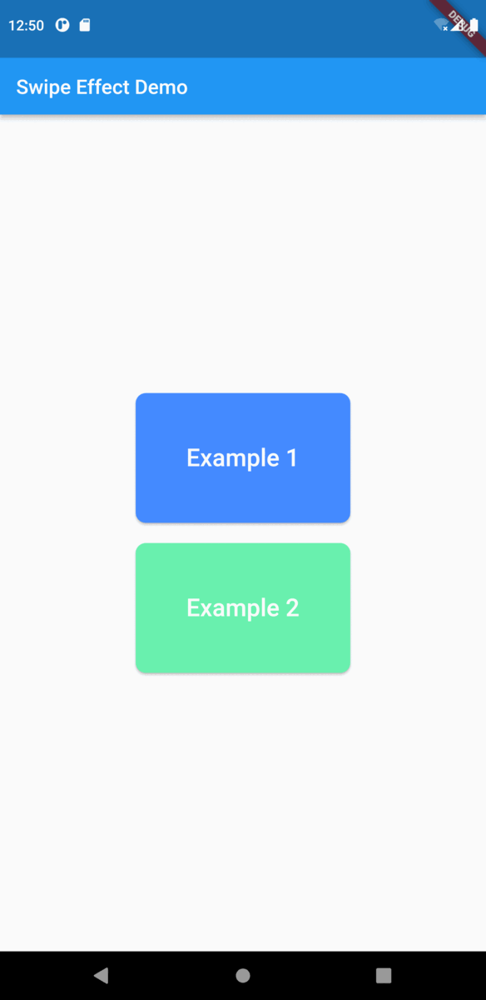

<!-- 
This README describes the package. If you publish this package to pub.dev,
this README's contents appear on the landing page for your package.

For information about how to write a good package README, see the guide for
[writing package pages](https://dart.dev/guides/libraries/writing-package-pages). 

For general information about developing packages, see the Dart guide for
[creating packages](https://dart.dev/guides/libraries/create-library-packages)
and the Flutter guide for
[developing packages and plugins](https://flutter.dev/developing-packages). 
-->


## 🪄 Swipe effect
A simple widget helps with adding an effect to your swipe actions.<br>
You can use it by wrapping your widget with <b>SwipeEffect</b> and listen to the swipes.


## ✨ Usage


```dart
SwipeEffect(
      direction: TextDirection.rtl, 
      color: Colors.green.withAlpha(70),
      verticalTolerance: 1.0,
      startDeltaPx: 30,
      callbackDeltaRatio: 0.25,
      callback: () {
        // Navigator.pop(context);
      },
      child: ...,
    );
```
## 🔮 Showcase

## ⚙️ Parameters

| Parameter | Description |
|---|---|
| `child`* | Your child widget. |
| `callback`* | A call back will be triggered after the swipe action. |
| `color`| Color of the effect curve. |
| `direction` | direction of the swipe `TextDirection.ltr` or`TextDirection.rtl` |
| `verticalTolerance`| Double value determines a ratio from the screen height that after swiping in vertical axis the effect will be dismissed. |
| `callbackDeltaRatio`| Double value determines a ratio from the screen width to trigger the callback after reaching it.|
| `startDeltaPx`|Determines where to start the effect from the beginning of the widget (in pixel) |


## 💻 Authors

- [Shadi Danhash](https://github.com/shadi-danhash)
- [Pierre Baba](https://github.com/PierreBaba)
